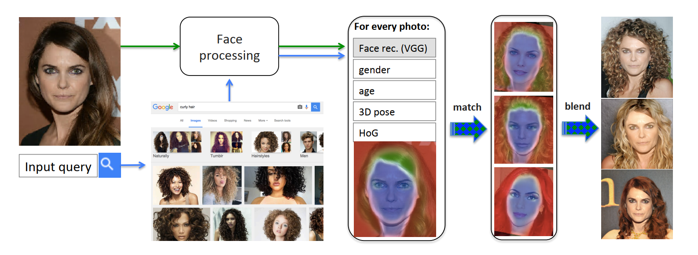

# Transfiguring Portraits
This is a face swapping system introduced in the paper[1]. Users could type a portrait style and take a selfie, then the system will return some own portraits with the input style by using image search engine and face swapping method.

Note: The detailed swapping method of this repo is not exactly the same as the original paper.

## Sample Results

- (Portrait - Barack Obama, Style - Blonde Hair) && (Portrait - Kobe Bryant, Style - Curl Hair)

- (Portrait - Donald Trump, Style - Kim Jong-un) && (Portrait - Leo Messi, Style - Cristiano Ronaldo)

## Installation and Usage

### Faceswap
Based on [face_swap](https://github.com/YuvalNirkin/face_swap/)[2,3] with minor changes. Please refer to [face_swap](https://github.com/YuvalNirkin/face_swap/) for more information. Remember to build it with python interface and copy built pyd/so module into backend folder, and also download the data including 3dmm face model, cnn models, etc into backend folder.

### Backend Server
Written by python3 with flask. Currently Bing image search is used with limited free account. Use your own account if you want to have a try. To run on local machine, please configure local ip and azure key in config.json file.

Install dependences by 
> pip -r install requirements.txt

Run server by
> python server.py

### Frontend App
Written by javascript with react-native.

Install dependences by 
> npm install 

Build and debug with build.sh and run.sh. Please refer to react-native docs for more details.

## Demo App
A simple client app for Android is also provided. Download and try!

Note: may not work well due to limited server resource, trying it yourself with local machine is recommended. 

## References
>1. Kemelmacher-Shlizerman, Ira. "Transfiguring portraits." ACM Transactions on Graphics (TOG) 35.4 (2016): 94.
>2. Tuan Tran, Anh, et al. "Regressing robust and discriminative 3D morphable models with a very deep neural network." Proceedings of the IEEE Conference on Computer Vision and Pattern Recognition. 2017.
>3. Nirkin, Yuval, et al. "On face segmentation, face swapping, and face perception." 2018 13th IEEE International Conference on Automatic Face & Gesture Recognition (FG 2018). IEEE, 2018.